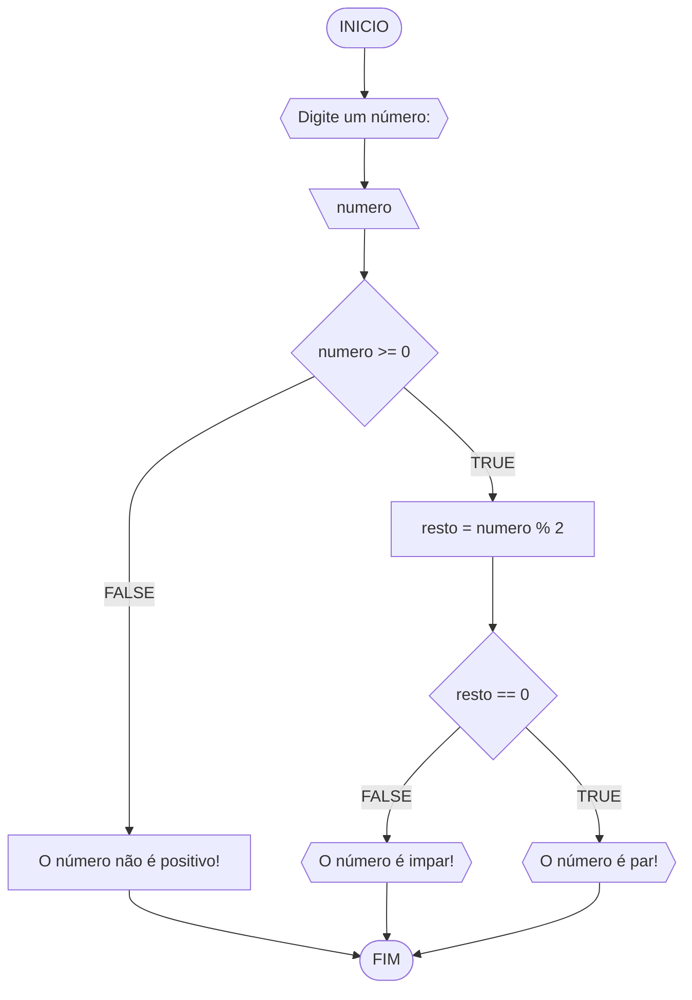
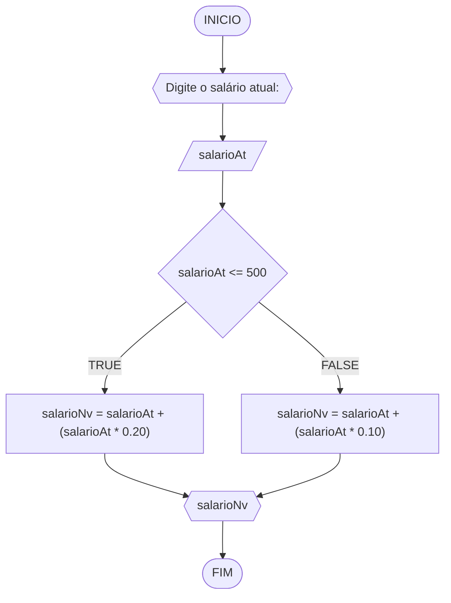
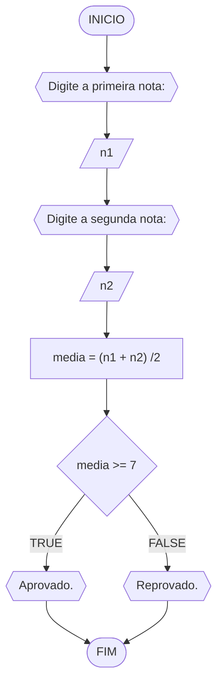
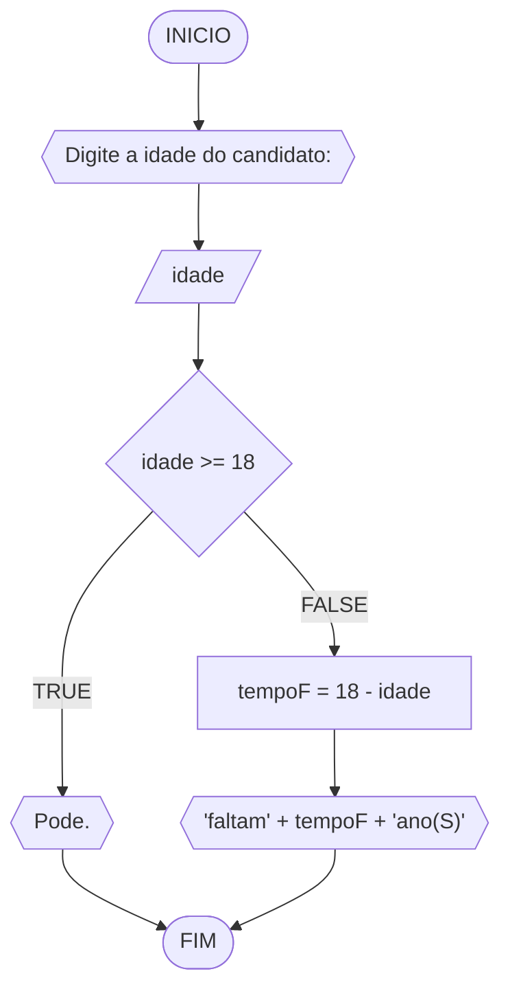

# Unifor - RLA
## lista de exercícios - 1
### 1 - Número ímpar ou par
#### Fluxograma

#### Pseudocódigo
```
1  ALGORTIMO verifica_par_impar
2  DECLARE numero, resto: INTEIRO
3  ESCREVA "Digite um número: "
4  INICIO
4  LEIA numero
5  SE numero >= 0 ENTAO                  // verifica se o inteiro é positivo
6    resto = numero % 2                 // calcula o resto da divisão por 2
7    SE resto == 0 ENTAO                // verifica se o resto é igual a zero
8      ESCREVA "O número é par!"
9    SENAO
10     ESCREVA "O número é impar!"
11   FIM_SE
11  SENAO                                // caso inteiro for negativo (condição linha 5)
12    ESCREVA "O número deve ser postivo!"
13  FIM_SE
13 FIM
```
#### Teste
| numero | numero >= 0 | resto | resto == 0| SAIDA |
|--- |--- |--- |--- |--- |
-1 | F |  | |"O número deve ser positivo!"|
0 | V | 0 | V |"O número é par!"|
13 | V | 1 | F |"O número é impar!"|
30 | V | 0 | F |"O número é par!"|

### 2 - Novo salário
#### Fluxograma

#### Pseudocódigo
```
1	ALGORITIMO novo_salario
2	DECLARE salarioAt :INTEIRO
			SalarioNv
3	INICIO
4	ESCREVA Digite o salário atual:
5	LEIA salarioAt
6	SE salarioAt <= 500 ENTAO
7		salarioNv = salarioAt + (salarioAt * 0.20)
8		SENAO 
9			salarioNv = salarioAt + (salarioAt * 0.10)
10	LEIA salarioNv
11	ESCREVA salarioNv
12	FIM_novo_salario
```
#### TESTE
|salarioAt | salarioAt <= 500 | salarioNV | SAIDA|
|--- |--- |--- |--- |
600| F | 660 |"660"
490 | T | 588 |"588"
1500 | F | 1650 |"1650"|

### 3 - Reprovado ou aprovado
####  Fluxograma

#### Pseudocódigo
```
1	ALGORITIMO aprovado_reprovado
2	DECLARE n1, n2 :INTEIRO
			media
3	INICIO
4	ESCREVA Digite a primeira nota:
5	LEIA n1 
6	ESCREVA Digite a segunda nota:
7	LEIA n2
8		media = (n1 + n2) /2
9	SE media >= 7 ENTAO
10 		ESCREVA "Aprovado."
11		SENAO 
12			ESCREVA "Reprovado."
13	FIM_aprovado_reprovado
```
#### TESTE
|n1 |n2 |media | media >= 7 | SAIDA|
|--- |--- |--- |--- |--- |
8 | 7 | 7.5 | T |"Aprovado."
5 | 6 | 5.5 | F |"Reprovado."
5 | 9 | 7 | T |"Aprovado."

### 4 - CNH

#### Fluxograma 

#### Pseudocódigo
```
1	ALGORITIMO cnh
2	DECLARE idade :INTEIRO
			tempoF
3	ESCREVA Digite a idade do candidato:
4	LEIA idade
5	SE idade >= 18 ENTAO
6		ESCREVA "Pode."
7		SENAO tempoF = 18 - idade
8		ESCREVA "faltam" + tempoF + "ano(s)"
9	FIM_cnh
```
#### TESTE 
| idade | idade >= 18 | tempoF | SAIDA
|--- |--- |---|--- |
18 | T |  |"Pode."
17| F | 1 |"Faltam 1 ano(s)."
32| T|  | "Pode."
