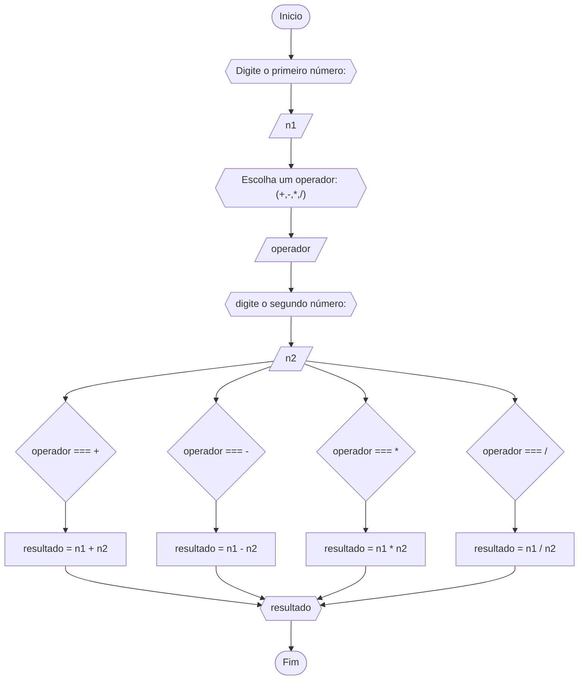

# Unifor - RLA
## lista de exercícios - AULA 3
### 1 - Calculo de média

#### Pseudocódigo
```
1 ALGORITIMO CalMedia
2 DECLARE N1, N2, N3, N4 : INTEIRO
		  media
3 INICIO
4 ESCREVA Digite as notas:		//solicita as notas
5 LEIA N1, N2, N3, N4
6 media ← (N1 + N2 + N3 + N4) /4	//calcula a media
7 ESCREVA media
8 FIM_CalMedia
```
#### TESTE
| N1 | N2 | N3 | N4 | media | SAIDA |
|--- |--- |--- |--- |--- |--- |
|5.0|5.5|7.0|6.0|5.8|"média = 5.8"
|4.0|15.0|9.0|26.0|27.0|"média = 27.0"
|6.0|6.0|6.0|6.0|6.0|"média = 6.0"

### 2 - Celsius para Fahrenheit

#### Pseudocódigo
```
1	ALGORITIMO CelsiusFahrenheit
2	DECLARE celsius :INTEIRO
		fahrenheit
3   INICIO
4   ESCREVA Digite a temperatura em celsius(C):		//solicita a temperatura em celcius
5 	LEIA celsius
6 	fahrenheit ← celsius * 1.8 + 32			//calcula a temperatura para transformar em fahrenheit
7 	ESCREVA fahrenheit
8 	FIM_CelsiusFahrenheit
```
#### TESTE
| celsius | fahrenheit | SAIDA | 
|--- |--- |--- |
|16|60.8|"Em Fahrenheit: 60.8"|
|-10|14.0|"Em Fahrenheit: 14.0"|
|32|89.6|"Em Fahrenheit: 89.6"|

### 3 - Calculadora

#### Pseudocódigo
```
1	ALGORITIMO CalculadoraSimples
2	DECLARE n1, n2 :INTEIRO
			operador
			resultado
3   INICIO
4   ESCREVA Digite o primeiro número:							//solicita o primeiro numero
5	LEIA n1
6	ESCREVA Escolha um operador: (+,-,*,/)						//solicita o operador
7 	LEIA operador
8 	ESCREVA digite o segundo número:						//solicita o segundo numero
9 	LEIA n2 
10 	SE operador === + ENTAO								//verifica o operador para realizar o calculo
11		resultado = n1 + n2							//calcula a soma
12		SE SENAO operador === - ENTAO						//verifica o operador para realizar o calculo
13			resultado = n1 - n2						//calcula a subtração
14				SE SENAO operador === * ENTAO				//verifica o operador para realizar o calculo		
15					resultado = n1 * n2				//calcula a multiplicação
16 						SE SENAO operador === / entao		//verifica o operador para realizar o calculo
17							resultado = n1 / n2		//calcula a divisão
18	ESCREVA resultado
19	FIM_CalculadoraSimples
```
#### TESTE
| n1 | operador | n2 | resultado | SAIDA |
|--- |--- |--- |--- |--- |
|5|*|3|15|"resultado: 15|
|9|/|3|1|"resultado: 1"|
|9|+|-2|7|"resultado: 7"|
|11.5|-|1.2|10|"resultado: 10.3"|

### 4 - Classificar idade

#### Pseudocódigo
```
1	ALGORITIMO ClassificarIdade
2	DECLARE idade
3   INICIO
4   ESCREVA Digite a idade:							//solicita a idade
5	LEIA idade
6	SE idade >= 5 or idade <= 7 ENTAO					//verifica se a idade é maior ou igual a 5 ou menor ou igual a 7
7 		ESCREVA Infantil A
8 		SE SENAO idade >= 8 or idade <= 10 ENTAO			//verifica se a idade é maior ou igual a 8 ou menor ou igual a 10
9 			ESCREVA Infantil B
10 			SE SENAO idade >= 11 or idade <= 13 ENTAO		//verifica se a idade é maior ou igual a 11 ou menor ou igual a 13
11				ESCREVA Juvenil A
12				SE SENAO idade >= 14 or idade <= 17 ENTAO	//verifica se a idade é maior ou igual a 14 ou menor ou igual a 17
13					ESCREVA Juvenil B
14					SE SENAO idade >= 18 ENTAO		//verifica se a idade é maior ou iguao a 18
15						ESCREVA Adulto
16 					SENAO 					//caso negativo
17					ESCREVA Inválido 
18	FIM_ClassificarIdade
```
#### TESTE
| idade | idade >= 5 or idade <= 7 | idade >= 8 or idade <= 10 | idade >= 11 or idade <= 13 | idade >= 14 or idade <= 17 | idade >= 18| SAIDA
|--- |--- |--- |--- |--- |--- |--- |
|5|T|F|F|F|F|Infantil A
|9|F|V|F|F|F|Infantil B
|19|F|F|F|F|V|Adulto
|15|F|F|F|V|F|Juvenil B
