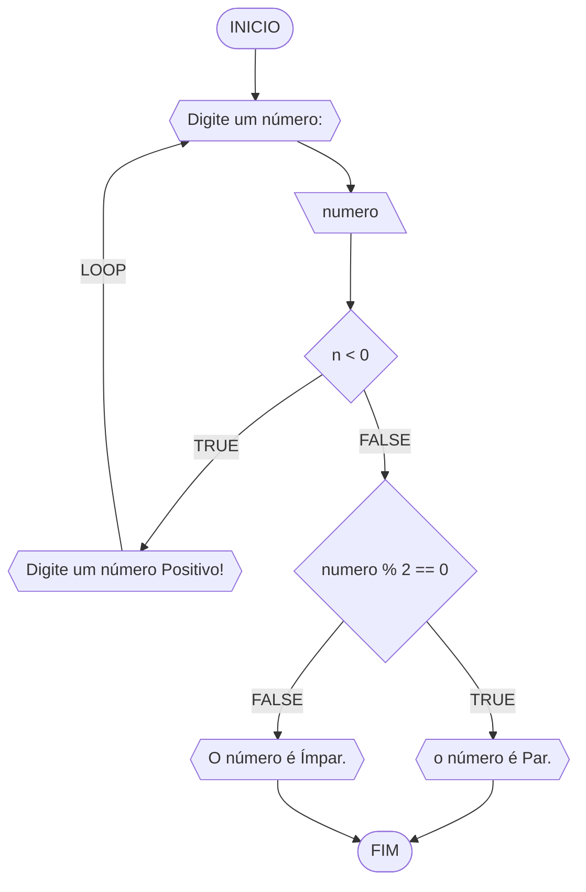
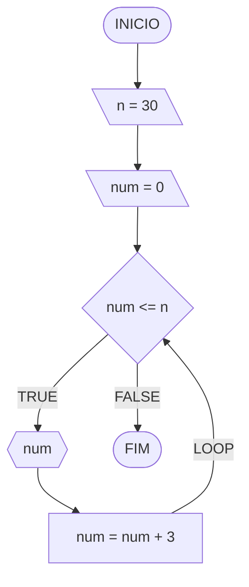
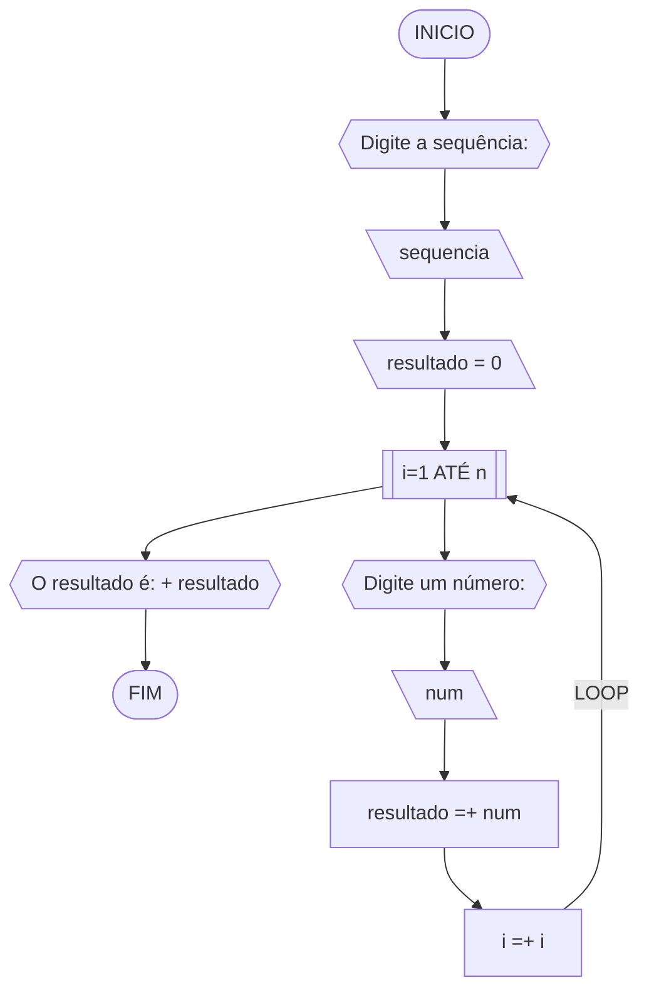
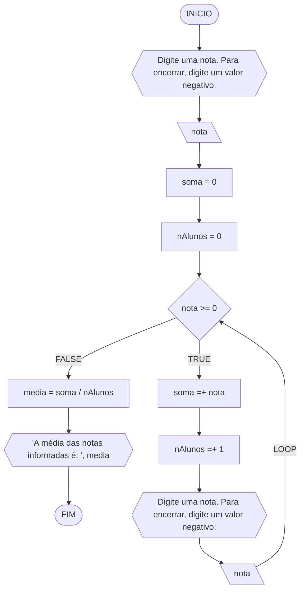

# UNIFOR - RLA
## Lista de exercícios - 3
### 1 - Número ímpar ou par atualizado
#### Fluxograma 

#### Pseudocódigo
```
1	Algoritmo verificar_par_impar
2	DECLARE n: INTEIRO
3	INICIO
4	ESCREVA "Digite um número:"
5	LEIA numero
6	ENQUANTO n < 0 FAÇA
7		ESCREVA "Digite um número Positivo!"
8		ESCREVA "Digite um número:"
9	FIM_ENQUANTO
10	SE n % 2 == 0 ENTAO
11		ESCREVA "O número é Par."
12	SENAO
13		ESCREVA "O número é Ímpar."
14	FIM_ALGORITMO
```

#### Teste de mesa (0.5 ponto)

| n | n < 0 | n % 2 == 0 | Saída |
|      --      |      --      |      --      |      --      |
| -5 | True |  | "Digite um número Positivo!" <br> "Digite um número:" |
| 7 | False | False | "O número é Ímpar." |
| 4 | False | True | "O número é Par." |

### Exercício 02 
#### Fluxograma 

#### Pseudocódigo 

```
1	Algoritmo 0_30
2	DECLARE n, num: INTEIRO
3	INICIO
4	n <- 30
5	num <- 0
6	ENQUANTO num <= n FAÇA
7		ESCREVA num
8		num <- num + 3	
9	FIM_ENQUANTO
10	FIM_0_30
```
#### Teste de mesa 

| it | n | num | num <= n | Saída | num =+ 3 |
|      --      |      --      |      --      |      --      |      --      |      --      | 
| 1 | 30 | 0 | True | 0 | 3 |
| 2 | 30 | 3 | True | 3 | 6 |
| 3 | 30 | 6 | True | 6 | 9 |
| 4 | 30 | 9 | True | 9 | 12 |
| 5 | 30 | 12 | True | 12 | 15 |
| 6 | 30 | 15 | True | 15 | 18 |
| 7 | 30 | 18 | True | 18 |21 |
| 8 | 30 | 21 | True | 21 | 24 |
| 9 | 30 | 24 | True | 24 | 27 |
| 10 | 30 | 27 | True | 27 | 30 |
| 10 | 30 | 30 | True | 30 | 33 |
| 10 | 33 | 33 | False |  |  |

### Exercício 03 (2.5 pontos)
Dada uma sequência de números inteiros, calcular a sua soma. 
Por exemplo, para a sequência {12, 17, 4, -6, 8, 0}, o seu programa deve escrever o número 35.

#### Fluxograma (1.0 ponto)


#### Pseudocódigo
```
1	Algoritmo soma_sequencia
2	DECLARE n, i: INTEIRO, resultado, num: REAL
3	INICIO
4	ESCREVA "Digite o tamanho da sequência de números que deseja somar: "
5	LEIA n
6	resultado <- 0
7	PARA i DE 1 ATÉ n FAÇA
8		ESCREVA "Digite um número: "
9		LEIA num
10		resultado <- resultado + num
11		i <- i + 1
12	FIM_PARA
13	ESCREVA "O resultado da soma dos números é: ", resultado
14	FIM_ALGORITMO
```
#### Teste de mesa (0.5 ponto)

| it | n  | num | i  | resultado =+ num |
| -- | -- | --   | -- | -- |
| 1  | 5 | 3 | 1 | 3 |
| 2  | 5 | 7 | 2 | 10 |
| 3  | 5 | 12.65 | 3 | 22.65 |
| 4  | 5 | -6 | 4 | 16.65 |
| 5  | 5 | 1.5 | 5 | 18.15 |

### Exercício 04 (2.5 pontos)
Escreva um programa que leia a nota de diversos alunos, até que seja digitada uma nota negativa. 
Nesse momento, ele mostra a média aritmética de todas as notas lidas e quantas notas foram lidas. 
Ex. Foram lidas 14 notas. A média aritmética é 6.75!

#### Fluxograma (1.0 ponto)



#### Pseudocódigo (1.0 ponto)

```
1	Algoritmo media_notas
2	DECLARE nota, soma, media: REAL, nAlunos: INTEIRO
3	INICIO
4	ESCREVA "Digite uma nota. Para encerrar, digite um valor negativo: "
5	LEIA nota
6	soma <- 0
7	nAlunos <- 0
8	ENQUANTO nota >= 0 FAÇA
9		soma <- soma + nota	
10		nAlunos <- nAlunos + 1		
11		ESCREVA "Digite uma nota. Para encerrar, digite um valor negativo:"
12		LEIA nota
13	FIM_ENQUANTO
14	media <- soma / nAlunos
15	ESCREVA "A média das notas informadas é: ", media
16	FIM_ALGORITMO
```

#### Teste de mesa (0.5 ponto)

| it | nota | soma | nAlunos | nota >= 0 | soma =+ nota | nAlunos =+ 1 | media = soma / nAlunos | Saída |
| -- | -- | --  | --       | --         | --       | --       | --       | --       |
| 1  | 10 | 0 | 0 | True | 10 | 1 |  |  |
| 2  | 8.6 | 10 | 1 | True | 18.6 | 2 |  |  |
| 3  | 6 | 18.6 | 2 | True | 24.6 | 3 |  |  |
| 4  | 9.4 | 24.6 | 3 | True | 34 | 4 |  |  |
| 5  | -1 | 34 | 4 | False |  |  | 8.5 | "A média das notas informadas é: 8.5" |
