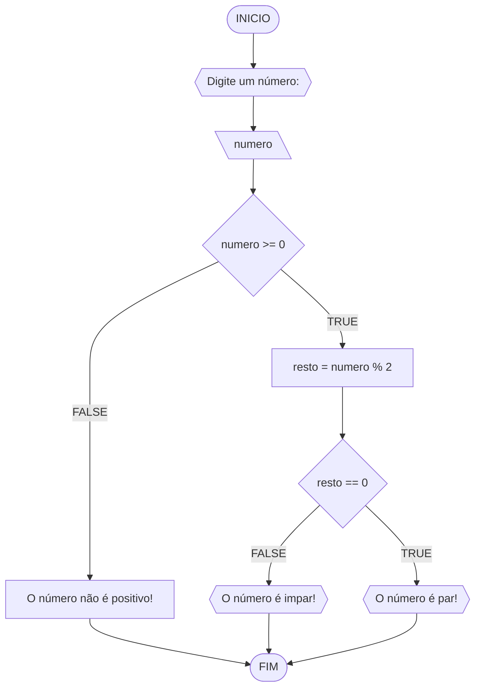

# Unifor - RLA
## lista de exercícios - 3
### 1 - Número ímpar ou par
#### Fluxograma

#### Pseudocódigo
```
1  ALGORTIMO verifica_par_impar
2  DECLARE numero, resto: INTEIRO
3  ESCREVA "Digite um número: "
4  INICIO
4  LEIA numero
5  SE numero >= 0 ENTAO                  // verifica se o inteiro é positivo
6    resto = numero % 2                 // calcula o resto da divisão por 2
7    SE resto == 0 ENTAO                // verifica se o resto é igual a zero
8      ESCREVA "O número é par!"
9    SENAO
10     ESCREVA "O número é impar!"
11   FIM_SE
11  SENAO                                // caso inteiro for negativo (condição linha 5)
12    ESCREVA "O número deve ser postivo!"
13  FIM_SE
13 FIM
```
#### Teste
| numero | numero >= 0 | resto | resto == 0| SAIDA |
|--- |--- |--- |--- |--- |
-1 | F |  | |"O número deve ser positivo!"|
0 | V | 0 | V |"O número é par!"|
13 | V | 1 | F |"O número é impar!"|
30 | V | 0 | F |"O número é par!"|
