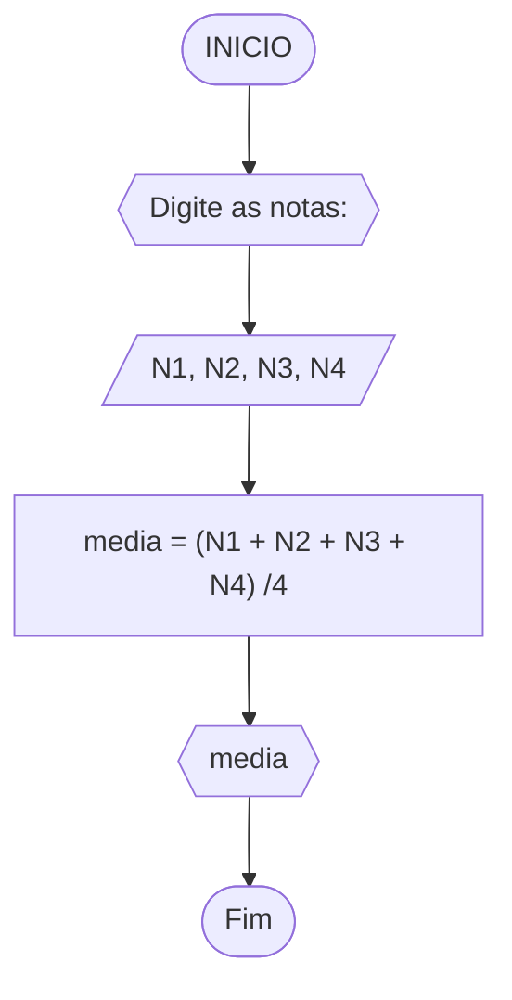
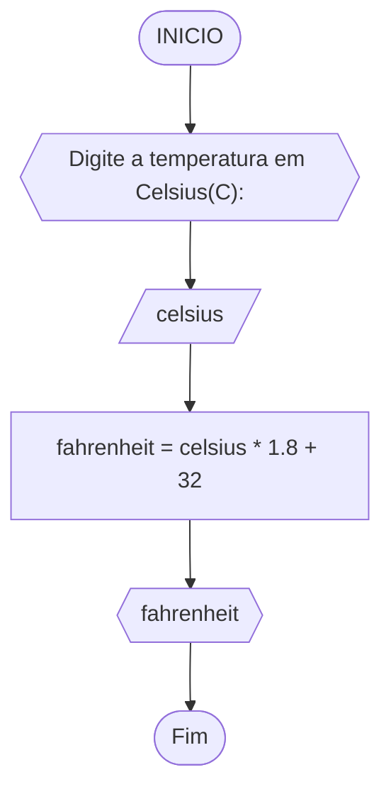
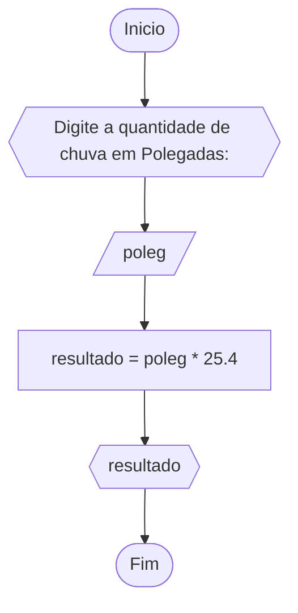
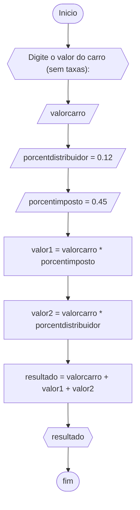
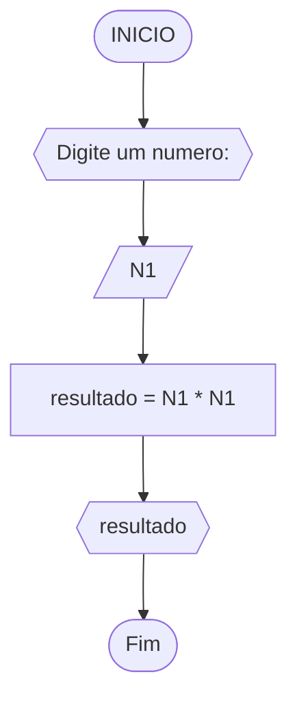
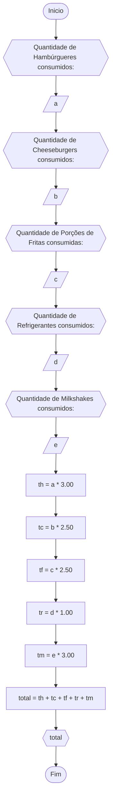
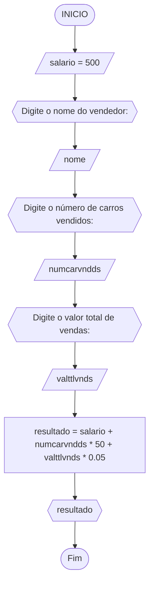
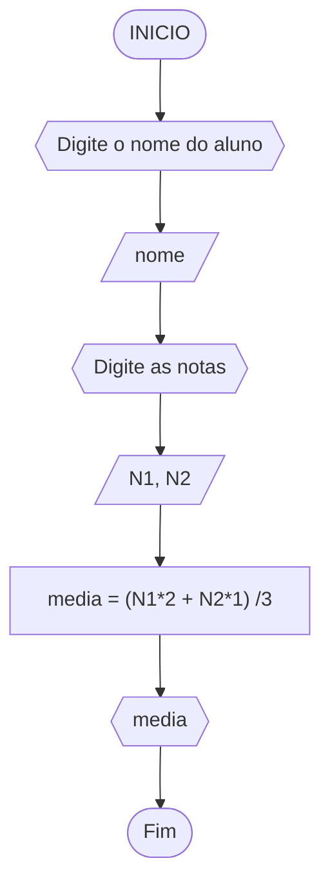
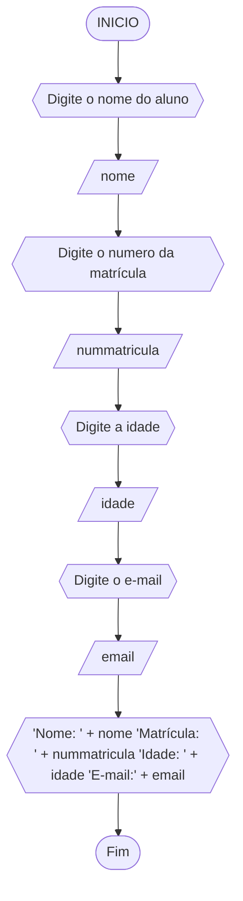
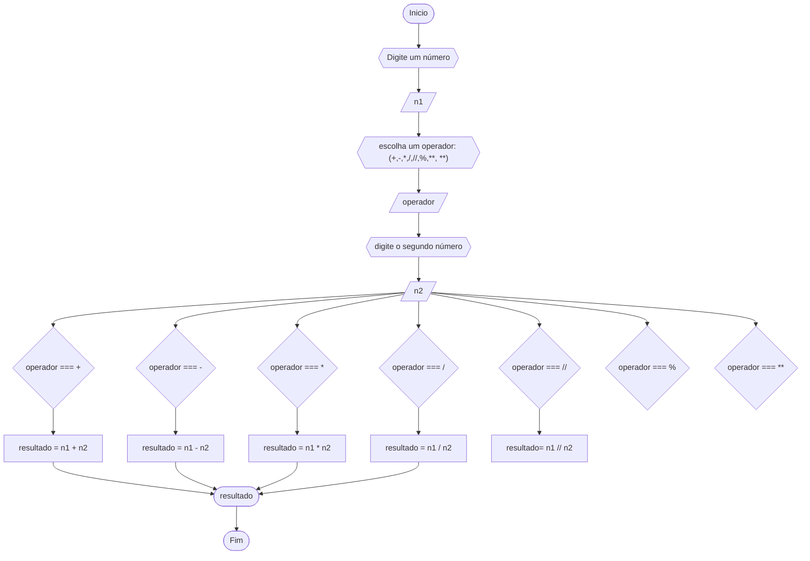

# Unifor - RLA
## lista de exercícios
### 1 - Calculo de média

#### Pseudocódigo
```
1 ALGORITIMO CalMedia
2 DECLARE N1, N2, N3, N4
				 media
3 INICIO
4 ESCREVA Digite as notas:
5 LEIA N1, N2, N3, N4
6 media → (N1 + N2 + N3 + N4) /4
7 ESCREVA media
8 FIM
```
### 2 - Celsius para Fahrenheit

#### Pseudocódigo
1	ALGORITIMO CelsiusFahrenheit
2	DECLARE celsius
					  fahrenheit
3  INICIO
4  ESCREVA Digite a temperatura em celsius(C):
5 	LEIA celsius
6 	fahrenheit → celsius * 1.8 + 32
7 	ESCREVA fahrenheit
8 	FIM

### 3 - Polegadas para Milímetros

#### Pseudocódigo
1	 ALGORITIMO PolgMilm
2 	DECLARE poleg
					  resultado
3	 INICIO
4	 ESCREVA Digite a quantidade de chuva em Polegadas:
5 	LEIA poleg
6 	resultado → poleg * 25.4
7 	ESCREVA resultado
8	 FIM

### 4 - Custo de um carro

#### Pseudocódigo
1 ALGORITIMO CustoCarro
2 DECLARE valorcarro
					  porcentdistribuidor
					  porcentimposto
					  valor1
					  valor2
					  resultado
3 	     INICIO
4 	     ESCREVA Digite o valor do carro (sem taxas):
5	     LEIA valorcarro
6       porcentdistribuidor → 0.12
7	     porcentimposto → 0.45
8 		 valor1 → valorcarro * porcentimposto
9 		  valor2 → valorcarro * porcentdistribuidor
10	 resultado → valorcarro + valor1 + valor2
11    ESCREVA resultado
12    FIM

### 5 - Número ao quadrado

#### Pseudocódigo
1	 ALGORITIMO NumQuad
2 	DECLARE N1
					  resultado
3	 INICIO
4	 ESCREVA Digite um numero:
5 	LEIA N1
6 	resultado → N1 * N1
7 	ESCREVA resultado
8	 FIM

### 6 - Cardápio de uma lanchonete

#### Pseudocódigo
1	 ALGORITIMO Lanchonete
2 	DECLARE a, b, c, d, e
					  th, tc, tf, tr, tm
					  total
3	 INICIO
4	 ESCREVA Quantidade de Hambúrgueres consumidos:
5	 LEIA a
6   ESCREVA Quantidade de Cheeseburgers consumidos:
7   LEIA b
8   ESCREVA Quantidade de Porções de Fritas consumidas:
9   LEIA c
10 ESCREVA Quantidade de Refrigerantes consumidos:
11 LEIA d
12 ESCREVA Quantidade de Milkshakes consumidos:
13 LEIA e
14 th → a * 3.00
15 tc → b * 2.50
16 tf → c * 2.50
17 tr → d * 1.00
18 tm → e * 3.00
19 total → th + tc + tf + tr + tm
20 ESCREVA total
21 FIM

### 7 - Calculo do salário final do vendedor

#### Pseudocódigo
1	 ALGORITIMO CalcSalario
2 	DECLARE salario
					  nome
					  numcarvndds
					  valttlvnds
					  resultado
3	 INICIO
4   salario → 500
5	 ESCREVA Digite o nome do vendedor:
6   LEIA nome
7   ESCREVA Digite o número de carros vendidos:
8   LEIA numcarvndds
9   ESCREVA Digite o valor total de vendas:
10 LEIA valttlvnds
11 resultado → salario + numcarvndds * 50 + valttlvnds * 0.05
12 ESCREVA resultado
11 FIM

### 8 - Calculo da média do aluno na disciplina RLA


### 9 - Ficha do usuário

### 10 - 
### 20 - Calculadora

