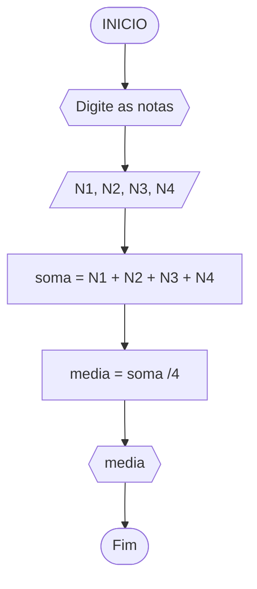

# Unifor - RLA
## lista de exercícios
### 1 - Calculo de média

```mermaid
flowchart TD
A([INICIO]) --> B{{Digite as notas}}
B --> C[/N1, N2, N3, N4/]
C --> D[soma = N1 + N2 + N3 + N4]
D --> E[media = soma /4]
E --> F{{media}}
F --> G([Fim])

```  
