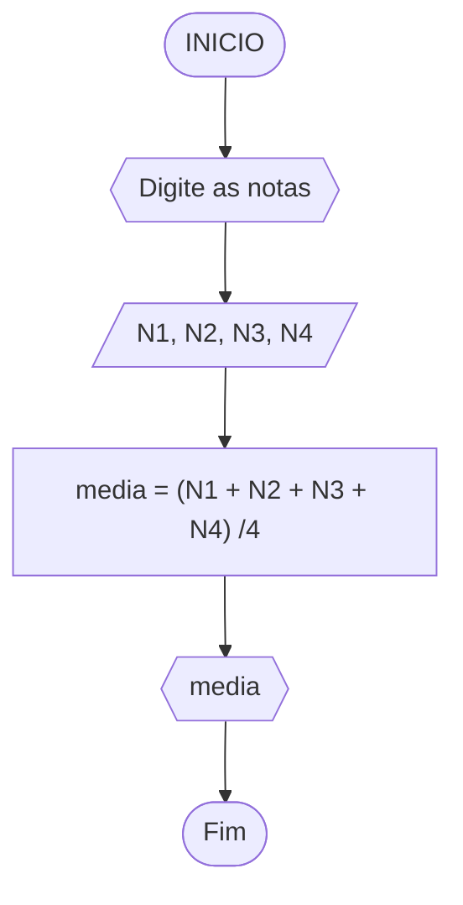

# Unifor - RLA
## lista de exercícios
### 1 - Calculo de média


### 2 - Celsius para Fahrenheit

### 3 - Polegadas para Milímetros

### 4 - Custo de um carro

### 5 - Número ao quadrado


### 6 - Cardápio de uma lanchonete
```mermaid
flowchart TD
A([Inicio]) --> B{{
```

### 7


### 20 - Calculadora 

