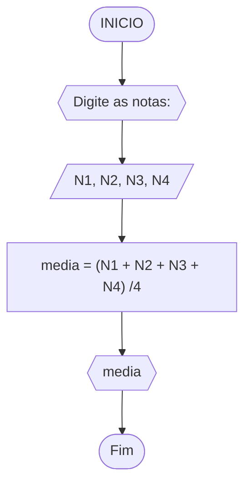
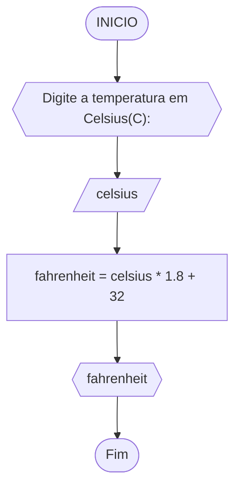
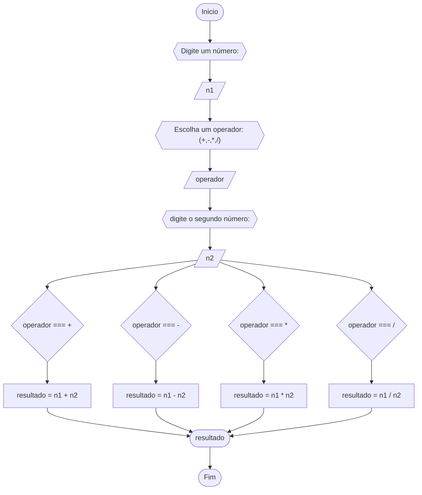

# Unifor - RLA
## lista de exercícios
### 1 - Calculo de média

#### Pseudocódigo
```
1 ALGORITIMO CalMedia
2 DECLARE N1, N2, N3, N4
		  media
3 INICIO
4 ESCREVA Digite as notas:
5 LEIA N1, N2, N3, N4
6 media ← (N1 + N2 + N3 + N4) /4
7 ESCREVA media
8 FIM_CalMedia
```
#### TESTE
| N1 | N2 | N3 | N4 | media | SAIDA |
|--- |--- |--- |--- |--- |--- |
|5.0|5.5|7.0|6.0|5.8|"média = 5.8"
|4.0|15.0|9.0|26.0|27.0|"média = 27.0"
|6.0|6.0|6.0|6.0|6.0|"média = 6.0"

### 2 - Celsius para Fahrenheit

#### Pseudocódigo
```
1	ALGORITIMO CelsiusFahrenheit
2	DECLARE celsius
			fahrenheit
3   INICIO
4   ESCREVA Digite a temperatura em celsius(C):
5 	LEIA celsius
6 	fahrenheit ← celsius * 1.8 + 32
7 	ESCREVA fahrenheit
8 	FIM_CelsiusFahrenheit
```
#### TESTE
| celsius | fahrenheit | SAIDA | 
|--- |--- |--- |
|16|60.8|"Em Fahrenheit: 60.8"|
|-10|14.0|"Em Fahrenheit: 14.0"|
|32|89.6|"Em Fahrenheit: 89.6"|

### 3 - Calculadora

#### Pseudocódigo
```
1	ALGORITIMO CalculadoraSimples
2	DECLARE n1
			n2
			operador
			resultado
3   INICIO
4   ESCREVA Digite um número:
5	LEIA n1
6	ESCREVA Escolha um operador: (+,-,*,/)
7 	LEIA operador
8 	ESCREVA digite o segundo número:
9 	LEIA n2 
10 	
```
#### TESTE
| n1 | operador | n2 | resultado | SAIDA |
|--- |--- |--- |--- |--- |
|5|*|3|15|"resultado: 15|
|9|/|3|1|"resultado: 1"|
|9|+|-2|7|"resultado: 7"|
|11.5|-|1.2|10|"resultado: 10.3"|


